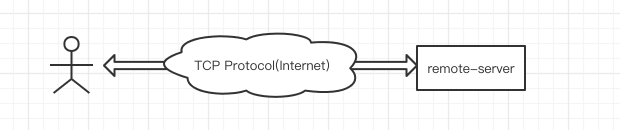

# Websocket Tunnel

Proxy a TCP protocol with websocket.
HTTP/HTTPS protocol not supported.

# Why or When

- proxy server that cannot reach directly, like socks5 but no client proxy config;
- access server with wss to avoid Man-in-the-middle attack;
- use cloudflare to protect/hide real server;

# How it works

## If not use wstunnel



## If use wstunnel


# Example Configure

- [server](./example/server.cfg.yaml)
- [local](./example/local.cfg.yaml)

```
> # start server
> CONF_FILE_PATH=./example/server.cfg.yaml go run cmd/server/main.go

> # start local
> CONF_FILE_PATH=./example/local.cfg.yaml go run cmd/local/main.go
```
